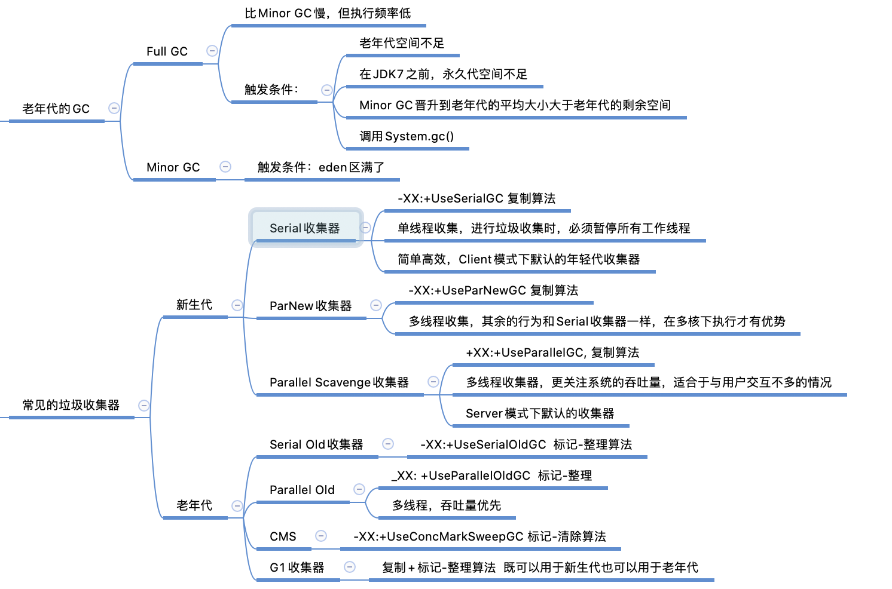

# JVM

### 类加载子系统作用
- 类加载子系统负责从文件系统或者网络中加载 class 文件， class 文件在文件开头有特定的文件标识
- ClassLoader 只负责 class 文件的加载，至于它是否可以运行则有 Execution Engine 决定
- 加载的类信息存放于一块称为方法区的内存空间。除了类的信息外，方法区中还存放运行时常量池信息，可能还包括字符串字面量和数字常量
- class 对象是存放在堆区的

### 类加载过程
		 加载：通过一个类的全限定名获取定义此类的二进制字节流，将这个字节流所代表的静态存储结构转化为方法区的运行时数据结构，在内存中生成一个代表这个类的 class 对象，作为方法区这个类的各种数据的入口
		 验证：确保 class 文件的字节流中包含信息符合当前虚拟机的要求，保证被加载类的正确性，不会危害虚拟机自身安全
		 准备：为类变量分配内存并且设置该类变量的默认初始值（即0值）
		 解析：将常量池内的符号引用转换为直接引用的过程
		 初始化：执行类构造器方法的过程
		 使用
		 卸载

### 双亲委派过程
- 工作过程
		 如果一个类加载器收到了类加载请求，它并不会自己先去加载，而是把这个请求委托给父类的加载器去执行
		 如果父类的加载器还存在其父类加载器，则进一步向上委托，依次递归，请求最终将到达顶层的启动类加载器
		 如果父类加载器可以完成类加载任务，就成功返回，倘若父类加载器无法完成加载任务，子加载器才会尝试自己去加载，这就是双亲委派模式

- 优势
避免类的重复加载以及保护程序安全，防止核心 API 被随意篡改

- 破坏双亲委派模型
> 只要重写 loadClass() 方法，指定新的加载逻辑就破坏了

	Tomcat 中使用了自定 ClassLoader，并且也破坏了双亲委派机制。每个应用使用 WebAppClassLoader 进行单独加载，它首先使用 WebAppClassLoader 进行类加载，如果加载不了再委派父加载器去加载，这样就可以保证每个项目中的类不冲突
	
	利用破坏双亲委派模型可以实现代码热替换。因为一个 Class 只能被一个 ClassLoader 加载一次，当我们想要实现代码热部署时，可以每次都 new 一个自定义的 ClassLoader 来加载新的 Class 文件。JSP 实现动态修改就是使用此特性实现

### JVM 主要结构
- ClassLoader
- RunTimeArea
- Execution Engine
- Native Interface

	JVM通过ClassLoader将符合特定格式的class文件加载进内存，交由ExecutionEngine对字节码中的命令进行解析，之后交由操作系统去执行

### 内存溢出和内存泄漏
- 内存溢出是申请的内存不够，撑不起我们需要的内存
- 内存泄露是申请了一块内存以后，无法释放掉这块内存，丢失了这段内存的引用

### 运行时数据区域
- 程序计数器
> 是一块较小的内存空间，它可以看作是当前线程所执行的字节码的行号指示器

	此内存区域是唯一一个在虚拟机规范中没有规定 OOM 异常的区域

- 虚拟机栈
	与程序计数器一样，虚拟机栈也是线程私有的，它的生命周期与线程相同。
	每个方法在执行的同时都会创建一个栈帧用于存放局部变量表、操作数栈、动态链接、方法出口等信息。每一个方法从调用直至执行完成的过程，就对应着一个栈帧在虚拟机中入栈到出栈的过程

- 本地方法栈
	 与虚拟机栈非常相似，主要是为虚拟机使用到的 native 方法服务

- 堆
	 Java 堆是被所有线程共享的一块内存区域，在虚拟机启动时创建。此内存区域的唯一目的就是存放实例对象

- 方法区
	 方法区也是被各个线程共享的一块内存区域，它用于存储已被虚拟机加载的类信息、常量、静态变量等数据

### 垃圾回收机制
- 判断对象是否存活
		 引用计数算法
		 可达性分析算法
	可以作为 GC ROOTS 的对象
		 虚拟机栈中引用的对象
		 方法区中类静态属性引用的对象
		 方法区中常量引用的对象
		 本地方法栈中 JNI 引用的对象

- 垃圾收集算法
	 - 标记-清除算法
	 	缺点：标记和清除的效率都不高；清除之后会产生大量的内存碎片

	 - 复制算法
	 	 将可用内存按容量划分为大小相等的两块，每次只使用其中的一块，当这一块的内存用完了，将还存活的对象复制到另一块上面，再一次性清理

	 - 标记-整理算法
	 	 让所有存活的对象都向一端移动，然后直接清理掉端边界以外的内存

	 - 分代收集算法
	 	 将堆分为老年代和新生代，新生代采用复制算法，老年代采用标记-清除算法或者标记-整理算法

### 常见垃圾收集器以及 GC

